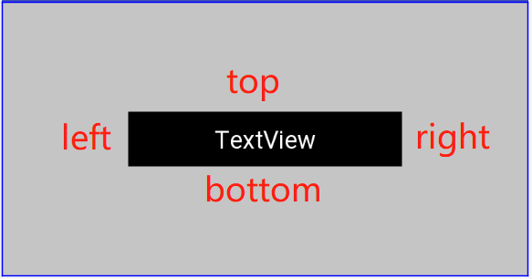
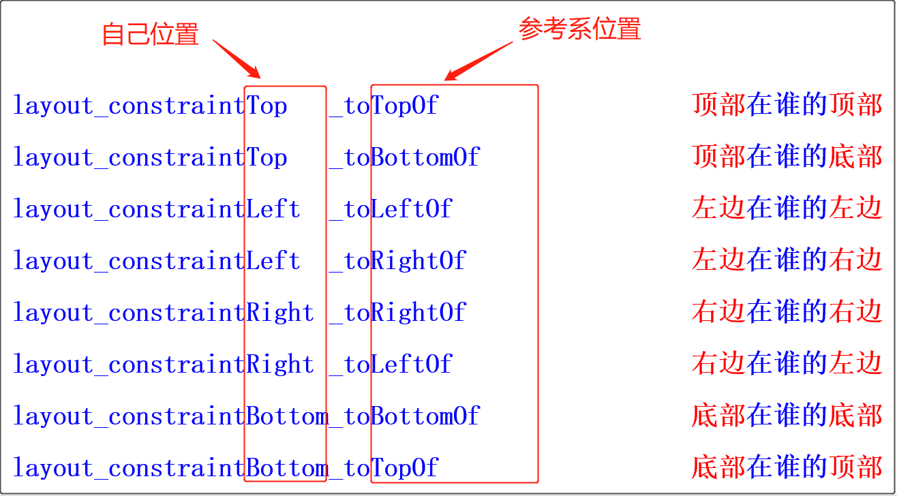

## 无所不能的ConstraintLayout全套讲解（有视频）-持续更新...

### 视频教程链接

* [ConstraintLayout介绍](http://v.youku.com/v_show/id_XMzkxODA5NTg1Ng==.html?spm=a2hzp.8244740.0.0)
* [ConstraintLayout入门案例](ConstraintLayout居中布局)
* [ConstraintLayout子控件相对位置的控制](http://v.youku.com/v_show/id_XMzkxODA5Njk0OA==.html?spm=a2hzp.8244740.0.0)
* [ConstraintLayout实现复杂布局](http://v.youku.com/v_show/id_XMzkxODA5NzUyMA==.html?spm=a2hzp.8244740.0.0)

### 1、ConstraintLayout介绍

* 1、2016年Google I/O推出的约束布局

* 2、优势：减少布局层次与嵌套、提升渲染性能

* 3、集RelativeLayout和百分比布局优势于一身

### 2、ConstraintLayout入门案例

> **从RelativeLayout快速切换到ConstraintLayout**

### 3、ConstraintLayout实现复杂布局

### 4、WRAP_CONTENT强制约束

### 5、圆形定位

### 6、坑爹的MATCH_PARENT